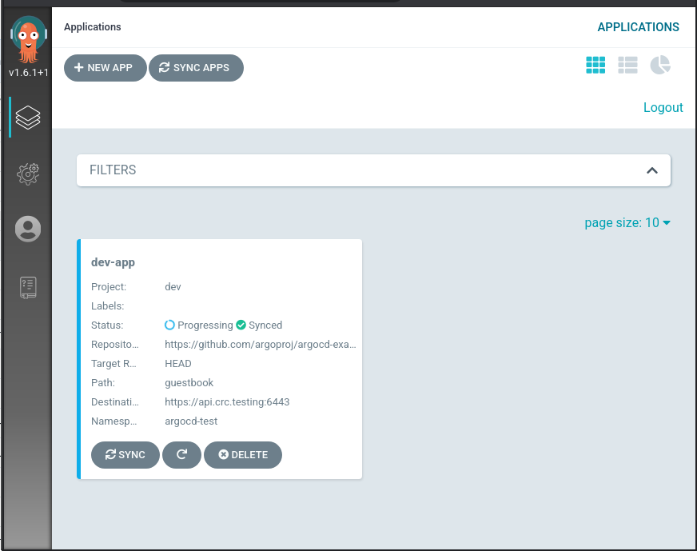

# Continous Deployment

This repository contains an opinionated reference architecture to setup, manage and operate a continous deployment pipeline on CRC.

## Instalation Steps

 * Setup CRC https://developers.redhat.com/products/codeready-containers/overview
   * add more memory to CRC : \
   `crc config set memory 16384` \
   `crc start`
 * Get `kustomize` and KSOPS using steps in https://github.com/operate-first/continuous-deployment/blob/master/docs/manage\_your\_app\_secrets.md
   * If you hit:\
``` unrecognized import path "vbom.ml/util": https fetch: Get "https://vbom.ml/util?go-get=1": dial tcp ```\
fix it with https://github.com/viaduct-ai/kustomize-sops/issues/60

* As an alternative to installing the prerequisites locally, you can use Toolbox: https://github.com/containers/toolbox \
   `toolbox create --image quay.io/aicoe/of-toolbox:v0.1.0` \
   `toolbox enter --container of-toolbox-v0.1.0` \
   Then you have all the tools needed running in a separate container.

 * Fork https://github.com/operate-first/continuous-deployment-crc

 * Import GPG key that is used by kustomize to encrypt the secrets.\
	```base64 -d < examples/key.asc | gpg --import ```
 * Proceed with [docs/setup_argocd_dev_environment.md](docs/setup_argocd_dev_environment.md)

Your ArgoCD instance will be running at https://argocd-server-aicoe-argocd-dev.apps-crc.testing/


